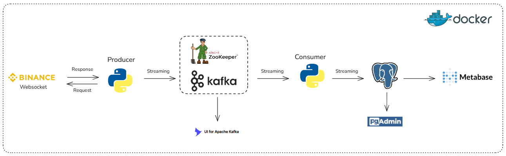
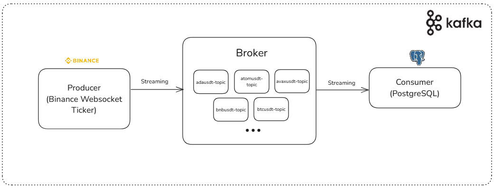

# Monitoramento Realtime Cripto
Trabalho de Conclusão de Curso da Especialização em Engenharia de Dados da PUC Minas Virtual com a temática "Pipeline de Dados para Monitoramento em Tempo Real de Criptomoedas".

## Arquitetura Geral

## Arquitetura Kafka
